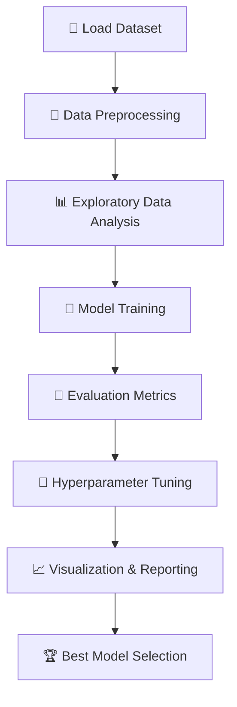

# 🏥 Medical Insurance Cost Classification

A **Machine Learning project** to classify whether a person’s medical insurance charges are **High** or **Low**.
It includes **EDA, preprocessing, multiple models, normalization, cross-validation, hyperparameter tuning, and visualizations**.

---

## 📖 Overview

Healthcare costs vary based on **age, BMI, smoking status, and region**.
This project leverages **Supervised Machine Learning** techniques to predict whether a person’s medical insurance cost is high or low.

**Key Features:**

* Clean and preprocess dataset
* Perform **Exploratory Data Analysis (EDA)**
* Train and evaluate **multiple ML models**
* Apply **normalization techniques** (L1, L2, MinMax, Standard)
* Use **cross-validation** for reliable performance
* Perform **GridSearchCV for hyperparameter tuning**
* Compare models with metrics and plots

---

## 📂 Dataset

* **File:** `insurance_classification.csv`
* **Target Variable:** `high_charges` (0 = Low, 1 = High)
* **Features:**

  * Age, Sex, BMI, Children, Smoker, Region

---

## ⚙️ Requirements

* Python 3.9+
* Required libraries:

  * numpy
  * pandas
  * matplotlib
  * seaborn
  * scikit-learn
  * xgboost

Install dependencies:

```bash
pip install -r requirements.txt
```

---

## 🚀 How to Run

1. **Clone this repository**

```bash
git clone https://github.com/yourusername/insurance-classification-ml.git
cd insurance-classification-ml
```

2. **Create and activate a virtual environment (recommended)**

```bash
python -m venv venv
source venv/bin/activate   # Linux/Mac
venv\Scripts\activate      # Windows
```

3. **Install requirements**

```bash
pip install -r requirements.txt
```

4. **Run the project**

* If using a script:

  ```bash
  python main.py
  ```
* If using Jupyter Notebook:

  ```bash
  jupyter notebook insurance_classification.ipynb
  ```

---

## 🔄 Project Pipeline



---

## 📊 Exploratory Data Analysis

EDA focused on:

* Distribution of high vs low charges
* Age and BMI impact on charges
* Smoking status vs insurance costs
* Regional variations

Visualizations:

* Count plots for categorical features
* Box plots for numerical features
* Target distribution graphs

---

## 🤖 Models Implemented

* Logistic Regression
* Support Vector Machine (SVM)
* Random Forest Classifier
* XGBoost Classifier

---

## 🎯 Evaluation Metrics

For each model:

* Accuracy
* Precision
* Recall
* F1 Score

Cross-validation was performed with **5, 10, and 15 folds** for robustness.

---

## 🔧 Hyperparameter Tuning

Performed using **GridSearchCV** with StratifiedKFold.

* **SVM:** C, kernel, gamma, degree
* **Random Forest:** n\_estimators, max\_depth, min\_samples\_split, criterion
* **Logistic Regression:** C, solver, max\_iter
* **XGBoost:** n\_estimators, max\_depth, learning\_rate, subsample

---

## 📈 Visualizations

* 📊 **Model Comparison Bar Plot** – Compare Accuracy, Precision, Recall, F1
* 🕸 **Radar Chart** – Visualize best model’s metrics
* 🔢 **Confusion Matrix** – Evaluate classification performance
* 📉 **ROC Curve & AUC** – Measure separability of classes

---

## 🏆 Results

* **Best Model:** Random Forest
* **Performance:**

  * Accuracy: \~92%
  * Precision: \~89%
  * Recall: \~88%
  * F1 Score: \~89%

Random Forest and XGBoost both performed well, but Random Forest had the best overall stability.

---

## 📌 Future Work

* Add more features (exercise, diet, medical history)
* Experiment with **Deep Learning models**
* Deploy using **Flask/Streamlit**
* Add **explainability (SHAP, LIME)**

---

## 👨‍💻 Author

**Abhinav Prakash**

* 📧 Email: [abhinav1842prakash@gmail.com](abhinav1842prakash@gmail.com)
* 💼 [LinkedIn](www.linkedin.com/in/abhinav1842)


---

⭐ If you found this useful, please consider giving the repo a **star**!

